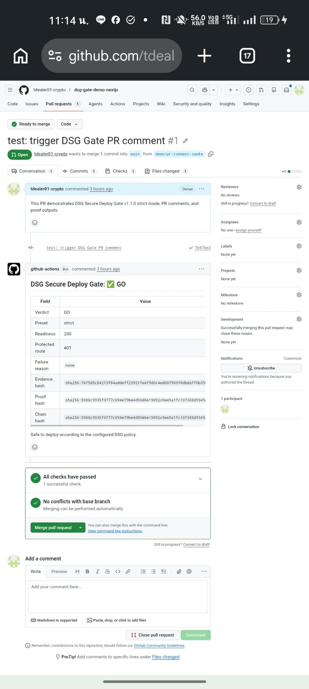
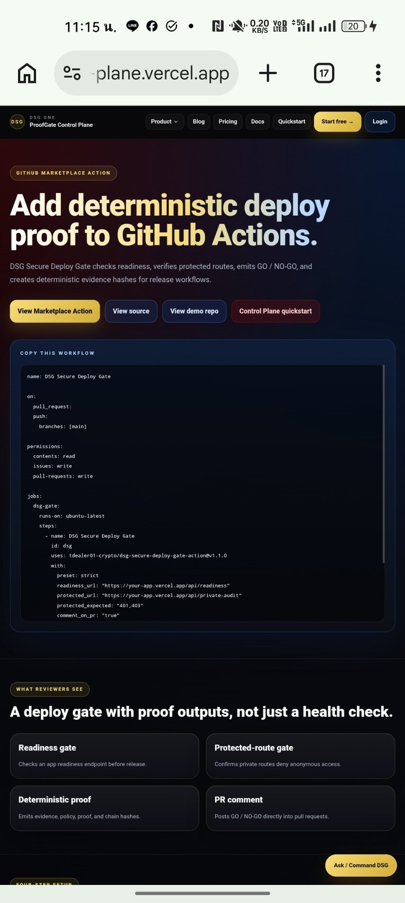
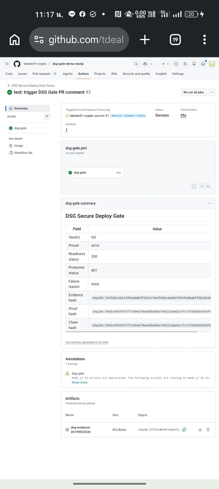
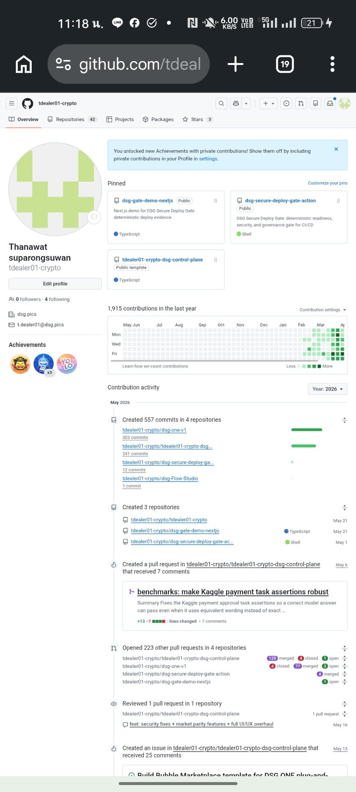

# DSG Verified Execution Gate

**Prove an automated action was authorized before you let it stand. Get a signed proof receipt for every run.**

v2 sends a bounded set of hashes and booleans to the Cinema `/verify/evaluate`
endpoint, which returns `ALLOW`, `REVIEW`, or `BLOCK` only when exact Z3
proves `VERIFIED_GLOBAL_OPTIMUM`. Anything less is reported as `REVIEW` — the
Action never converts an unverified proof into an approval.

Built for teams running AI agents or automated deploys that need to answer
"who authorized this, and can you prove it" after the fact.

> **Truth boundary:** this Action generates reproducible execution evidence. It
> is not, by itself, a PDPA, ISO 27001, SOC 2, WORM, or third-party compliance
> certification.

## Links

- Landing page: https://dsgoneverifiedweb.z1.web.core.windows.net/
- API docs: https://dsg-cinema-production.nicetree-a005fe99.westus3.azurecontainerapps.io/docs
- Demo repo: https://github.com/tdealer01-crypto/dsg-gate-demo-nextjs
- Marketplace: https://github.com/marketplace/actions/dsg-secure-deploy-gate

## Upgrading from v1

v1 (`DSG Secure Deploy Gate`, readiness-probe contract) stays available under
its immutable tags — `@v1.1.0` and earlier are unaffected by this release. See
[MIGRATION.md](MIGRATION.md) for the v1 → v2 mapping.

## v2 quick start

```yaml
- uses: tdealer01-crypto/dsg-secure-deploy-gate-action@v2.0.0
  id: gate
  with:
    endpoint: https://dsg-cinema-production.nicetree-a005fe99.westus3.azurecontainerapps.io/verify/evaluate
    api_key: ${{ secrets.DSG_API_KEY }}   # optional; free plan allows 25 proofs
    approved_plan_hash: ${{ steps.plan.outputs.sha256 }}
    proposed_action_hash: ${{ steps.action.outputs.sha256 }}
    authorized: 'true'
    plan_aligned: 'true'
    constraints_pass: 'true'
    execution_succeeded: 'true'
    replay_match: 'true'
    evidence_complete: 'true'
    fail_on_review: 'true'

- run: echo "${{ steps.gate.outputs.decision }} ${{ steps.gate.outputs.proof_hash }}"
```

Outputs: `decision`, `proof_hash`, `context_hash`, `receipt_file`,
`remediation`. The receipt is written to `dsg-proof-receipt.json`.

---

## v1 reference (readiness gate)

Everything below documents the v1 contract, still served by `@v1.1.0`.

---

## Evidence screenshots

| PR comment GO | Landing page |
|---|---|
|  |  |

| Demo workflow success | GitHub profile pins |
|---|---|
|  |  |

---

## What it does

- Checks a readiness endpoint such as `/api/readiness`.
- Optionally requires JSON body field `ok: true`.
- Optionally checks that a protected route denies unauthenticated access.
- Emits `GO` / `NO-GO`.
- Writes a deterministic evidence JSON file.
- Computes SHA-256 `evidence_hash`, `policy_hash`, `proof_hash`, and `chain_hash`.
- Optionally posts a PR comment with the result.
- Can run in blocking mode or audit-only mode.

---

## Quick start

```yaml
name: DSG Secure Deploy Gate

on:
  pull_request:
  push:
    branches: [main]

permissions:
  contents: read
  issues: write
  pull-requests: write

jobs:
  dsg-gate:
    runs-on: ubuntu-latest
    steps:
      - name: DSG Secure Deploy Gate
        id: dsg
        uses: tdealer01-crypto/dsg-secure-deploy-gate-action@v1
        with:
          preset: strict
          readiness_url: "https://your-app.vercel.app/api/readiness"
          protected_url: "https://your-app.vercel.app/api/private-audit"
          protected_expected: "401,403"
          comment_on_pr: "true"

      - name: Upload DSG evidence
        if: always()
        uses: actions/upload-artifact@v4
        with:
          name: dsg-evidence-${{ github.run_id }}
          path: dsg-evidence.json
```

Use `@v1` for compatible v1 updates. Pin an exact version, for example `@v1.1.0`, when you need release immutability.

---

## Presets

| Preset | Checks | Fails job on NO-GO? | Best for |
|---|---|---:|---|
| `basic` | HTTP status only | yes, unless `fail_on_no_go=false` | Simple uptime gate |
| `standard` | HTTP status + `ok:true` | yes, unless `fail_on_no_go=false` | Most SaaS apps |
| `strict` | HTTP status + `ok:true` + protected route | yes, unless `fail_on_no_go=false` | Production deploys |
| `audit-only` | Runs configured checks and reports evidence | no | Non-blocking rollout |

`strict` requires `protected_url`. This is intentional: a strict gate should verify that protected surfaces are not publicly reachable.

---

## Inputs

| Input | Required | Default | Description |
|---|---:|---|---|
| `readiness_url` | yes | none | Readiness endpoint URL. |
| `expected_status` | no | `200` | Expected readiness HTTP status code. |
| `require_json_ok` | no | `true` | Require readiness response JSON to contain `ok: true`. |
| `protected_url` | no | empty | Protected route URL expected to deny unauthenticated access. |
| `protected_expected` | no | `401,403` | Comma-separated expected protected-route statuses. |
| `preset` | no | `strict` | `basic`, `standard`, `strict`, or `audit-only`. |
| `comment_on_pr` | no | `false` | Post or update a DSG result comment on pull requests. |
| `evidence_file` | no | `dsg-evidence.json` | Evidence JSON output path. |
| `policy_name` | no | `production-readiness` | Logical policy name stored in evidence. |
| `policy_version` | no | `v1` | Logical policy version stored in evidence. |
| `previous_proof_hash` | no | empty | Previous proof hash for chain linking. |
| `proof_timestamp` | no | current UTC time | Optional fixed timestamp for reproducible test fixtures. |
| `fail_on_no_go` | no | `true` | Fail the job when verdict is `NO-GO`. Ignored by `audit-only`. |

---

## Outputs

| Output | Meaning |
|---|---|
| `verdict` | `GO` or `NO-GO` |
| `readiness_status` | HTTP status from readiness endpoint |
| `protected_status` | HTTP status from protected route, or empty if not checked |
| `failure_reason` | Machine-readable NO-GO reason |
| `evidence_hash` | SHA-256 hash of canonical evidence without the `hashes` object |
| `policy_hash` | SHA-256 hash of canonical policy object |
| `proof_hash` | SHA-256 hash of canonical proof object |
| `chain_hash` | `proof_hash` or `SHA256(previous_proof_hash + proof_hash)` |
| `evidence_file` | Evidence JSON file path |

---

## Example PR comment

```md
## DSG Secure Deploy Gate: GO

| Field | Value |
|---|---|
| Verdict | GO |
| Preset | strict |
| Readiness | 200 |
| Protected route | 401 |
| Evidence hash | `sha256:...` |
| Chain hash | `sha256:...` |

Safe to deploy.
```

---

## Deterministic proof model

DSG uses canonical JSON hashing:

```text
canonical_json = JSON with sorted keys, compact separators, UTF-8
evidence_hash = SHA256(canonical(evidence without hashes))
policy_hash   = SHA256(canonical(policy))
proof_hash    = SHA256(canonical({evidence_hash, policy_hash, run_id, timestamp}))
chain_hash    = proof_hash if previous_proof_hash is empty
chain_hash    = SHA256(previous_proof_hash + proof_hash) otherwise
```

The proof is deterministic for the same observed inputs:

```text
same policy + same observed checks + same GitHub metadata + same timestamp
= same evidence_hash, proof_hash, and chain_hash
```

Live HTTP endpoints are external systems. If a service changes status, body, commit SHA, run id, or timestamp, the evidence changes. That is expected and useful.

---

## Verify evidence locally

```bash
python3 scripts/verify-proof.py dsg-evidence.json
```

Expected output:

```text
DSG proof verification: PASS
```

---

## Demo app

Live demo repository: https://github.com/tdealer01-crypto/dsg-gate-demo-nextjs

See [`examples/demo-nextjs`](examples/demo-nextjs) for a minimal Next.js app with:

- `/api/readiness` returning `{ "ok": true }`
- `/api/private-audit` returning `401` without a bearer token
- a complete GitHub Actions workflow that starts the app and runs DSG Gate

---

## Upgrade path

The open-source Action is free. The planned paid control plane should add convenience features such as proof history, multi-repo dashboards, Slack alerts, audit exports, policy templates, and team approvals.

See [`docs/pricing.md`](docs/pricing.md).

---

## Claim boundary

Supported claims:

```text
DSG Secure Deploy Gate is an open-source GitHub Action that checks readiness,
checks protected-route behavior, emits GO / NO-GO, and writes deterministic
SHA-256 evidence hashes.
```

Do not claim from this Action alone:

```text
Certified PDPA compliance
Certified ISO 27001 compliance
SOC 2 certification
WORM-certified storage
Third-party audit completion
End-to-end formal verification of a production SaaS
```

Those require organizational controls, legal review, independent audit, production evidence retention, access governance, and environment-specific validation.

---

## License

See repository license.


---

## Marketplace packaging note

This repository intentionally keeps runnable workflow examples outside `.github/workflows/`.
Copy `examples/workflows/dsg-gate.example.yml` into your own repository at
`.github/workflows/dsg-gate.yml`.

GitHub Marketplace publishing requires the action repository to stay focused on a
single root `action.yml` plus the files needed by the action. Example workflows are
provided as `.example.yml` documentation files, not active workflows in this repository.
